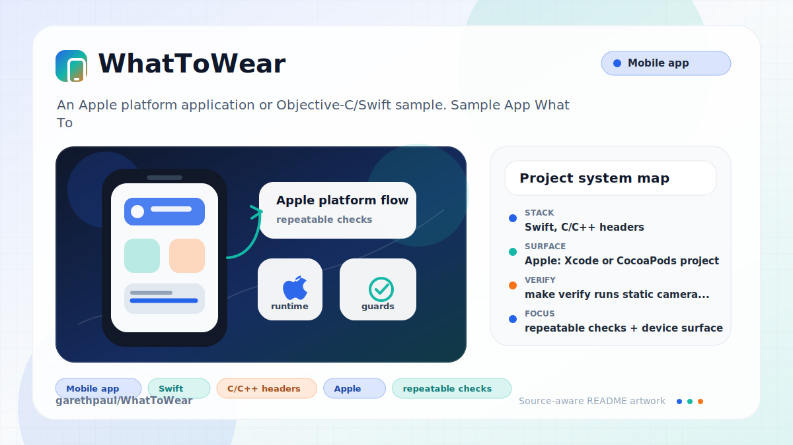
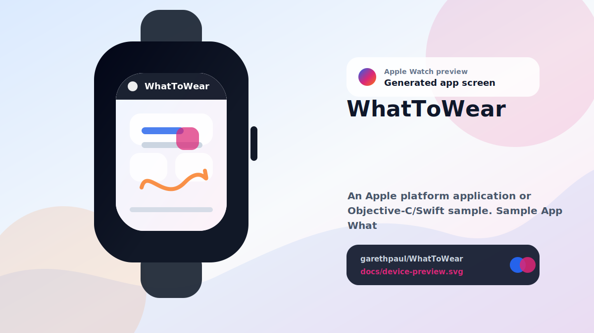

# WhatToWear

<!-- README-OVERVIEW-IMAGE -->


## Device Preview

<!-- DEVICE-PREVIEW-IMAGE -->


## Overview

`garethpaul/WhatToWear` is an Apple platform application or Objective-C/Swift sample. Sample App What To Wear

This README is based on the checked-in source, manifests, scripts, and repository metadata on the `master` branch. The project language mix found during review was: Swift (6), C/C++ headers (1).

## Repository Contents

- `SECURITY.md` - security reporting and disclosure guidance
- `VISION.md` - project direction and maintenance guardrails
- `What To Wear` - source or example code
- `What To Wear.xcodeproj` - Xcode project file
- `What To WearTests` - source or example code

Additional scan context:

- Source directories: What To Wear, What To WearTests
- Dependency and build manifests: none detected
- Entry points or build surfaces: What To Wear.xcodeproj
- Test-looking files: What To WearTests/Info.plist, What To WearTests/What_To_WearTests.swift

## Getting Started

### Prerequisites

- Git
- macOS with Xcode for building Apple platform projects

### Setup

```bash
git clone https://github.com/garethpaul/WhatToWear.git
cd WhatToWear
```

The setup commands above are derived from repository files. Legacy mobile, Python, or JavaScript samples may require older SDKs or package versions than a modern workstation uses by default.

## Running or Using the Project

- Open `What To Wear.xcodeproj` in Xcode, choose the app or sample scheme, and run it on the matching simulator/device.

## Testing and Verification

- `make verify` runs static camera privacy, local-storage, capture, display
  image, display CGImage, photo write-success, capture input-port, camera
  session input/output, and app-launch mask focus touch, countdown timer, and
  camera console logging checks and attempts an Xcode build when `xcodebuild`
  is available.
- `make check` runs `make verify` with bytecode cleanup before and after.
- `python3 scripts/check_whattowear_contracts.py` runs the static
  WhatToWear contracts without the optional Xcode build.
- GitHub Actions runs the portable `make check` gate on Python 3.10 and 3.12
  with read-only permissions. Linux jobs intentionally skip Xcode compilation.
- Completed maintenance plans live under `docs/plans` and are checked by
  `make check`.
- Xcode's test action or `xcodebuild test` can be used with the appropriate scheme and destination on a macOS/Xcode workstation.

When the required SDK or runtime is unavailable, use static checks and source review first, then verify on a machine that has the matching platform toolchain.

## Configuration and Secrets

- No required secret or credential file was identified in the repository scan. If you add integrations later, keep secrets out of git.
- Camera access uses `NSCameraUsageDescription` to explain that the app captures a local outfit photo for preview.

## Security and Privacy Notes

- Review changes touching authentication or token handling; examples from the scan include What To Wear/ViewController.swift.
- Review changes touching network requests, sockets, or service endpoints; examples from the scan include What To Wear/Info.plist, What To WearTests/Info.plist.
- Review changes touching mobile permissions or privacy-sensitive device data; examples from the scan include What To Wear/DisplayImage.swift, What To Wear/ViewController.swift.
- Review changes touching file, media, JSON, XML, CSV, OCR, or data parsing; examples from the scan include What To Wear/DisplayImage.swift, What To Wear/Info.plist, What To Wear/ViewController.swift, What To WearTests/Info.plist.

## Maintenance Notes

- This looks like an Apple platform project or sample. Xcode, Swift, CocoaPods, and deployment target versions may need to match the original project era.
- See `SECURITY.md` for vulnerability reporting and safe research guidance.
- See `VISION.md` for project direction and contribution guardrails.
- See `docs/plans/2026-06-08-camera-privacy-contract.md` for the current
  camera privacy baseline.
- See `docs/plans/2026-06-08-camera-capture-guards.md` for the camera capture
  failure and image-conversion guard contract.
- See `docs/plans/2026-06-09-photo-write-success-guard.md` for only showing
  the display flow after the local JPEG write succeeds.
- See `docs/plans/2026-06-08-display-image-load-guard.md` for saved capture
  display fallback behavior.
- See `docs/plans/2026-06-09-display-cgimage-guard.md` for guarding mirrored
  preview construction when a saved image has no `CGImage` backing.
- See `docs/plans/2026-06-09-launch-mask-guards.md` for app-launch mask asset
  and optional-state guards.
- See `docs/plans/2026-06-09-camera-input-port-guards.md` for optional
  AVCapture connection input-port guard coverage.
- See `docs/plans/2026-06-09-camera-session-input-guards.md` for guarded
  capture session input and output setup.
- See `docs/plans/2026-06-09-focus-touch-guards.md` for guarded touch handling
  in the camera focus controls.
- See `docs/plans/2026-06-09-countdown-timer-guard.md` for duplicate countdown
  timer prevention.
- See `docs/plans/2026-06-09-camera-console-log-guard.md` for camera setup
  console logging prevention.
- See `docs/plans/2026-06-10-hosted-static-verification.md` for the pinned,
  least-privilege hosted contract baseline.

## Contributing

Keep changes small and tied to the project that is already present in this repository. For code changes, document the toolchain used, avoid committing generated dependency directories or local configuration, and update this README when setup or verification steps change.
